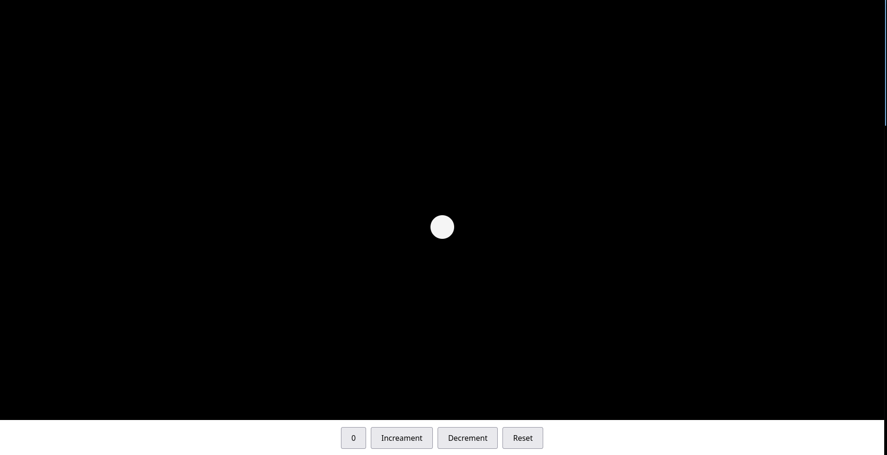

# interactive-ball-counter
This is a simple and fun beginner JavaScript project where a counter not only increases and decreases, but also visually **grows a ball** on the screen. It includes visual feedback through color changes, smooth transitions, and optional glow animations.


# ✨ Features

- ✅ Increment, Decrement, and Reset Counter
- 🟢 Ball grows in size with each increment
- 🔴 Ball size resets on "Reset"
- 🌈 Changes color every 5th count
- 💫 Optional glowing pulse effect on color change
- 🎮 Buttons fixed to bottom for mobile-friendly UX

---

# 📸 Preview



Concepts Practiced

- DOM Manipulation (`getElementById`, `textContent`, `style`)
- Event Handling (`addEventListener`)
- Basic CSS styling and animation
- Conditional rendering
- Layout with Flexbox
- JavaScript logic with functions and variables

---
 How to Run It Locally

1. Clone the repository:

```bash
git clone https://github.com/krishnasingh020/interactive-ball-counter.git